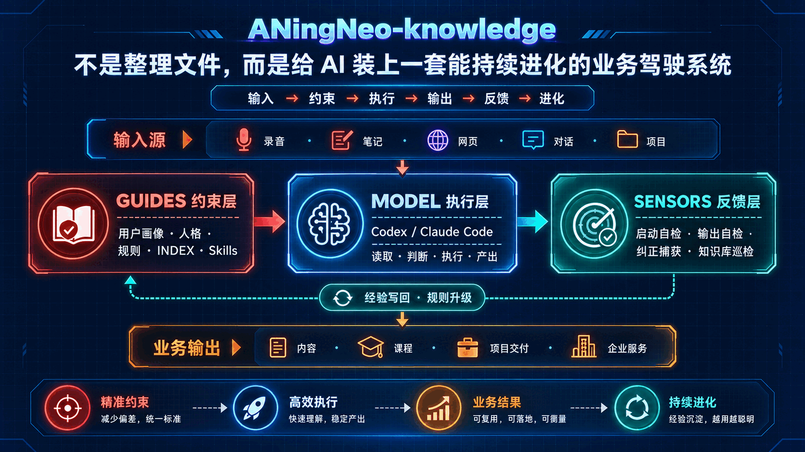

# ANingNeo Skills

> 把重复、复杂、容易出错的任务，整理成 AI 可以稳定执行的工作流。

ANingNeo Skills 面向真实业务使用，不是提示词收藏夹。每个 Skill 都包含明确的输入、执行步骤、风险边界、输出格式和验证方式，让 Agent 不只是“会回答”，而是能按规则完成一整段工作。

[下载最新版本](https://github.com/8533502-dev/ANingNeo-skills/releases/latest) · [查看全部 Skills](skills/)

## 你能用它做什么

| Skill | 核心用途 | 当前状态 |
| --- | --- | --- |
| [\`aningneo-knowledge\`](skills/aningneo-knowledge/) | 把个人、团队或自媒体资料整理成 AI 能持续读取和维护的知识系统 | v0.4.0 |
| [\`aningneo-research\`](skills/aningneo-research/) | 调研多平台账号、作品、评论、字幕与公开数据，批量前先估算请求和费用 | v0.8.0 |
| [\`Jiang-local-store\`](skills/jiang-local-store/) | 为实体门店制作菜品图、菜单、活动海报、门头预览和图文笔记 | v0.1.1 |

三套能力可以独立安装，也可以组合使用：

- 用 \`aningneo-research\` 获取公开信息与结构化素材；
- 用 \`aningneo-knowledge\` 沉淀资料、规则和项目经验；
- 用 \`Jiang-local-store\` 完成门店视觉内容与推广物料。

## 设计方式

ANingNeo Skills 统一遵循四个原则：

1. **先讲清楚再执行**：范围、依赖、费用和风险在任务开始前说明。
2. **先小样再批量**：先验证少量结果，确认路线有效后再扩大规模。
3. **事实与判断分开**：原始信息、外部观点、用户结论和 Agent 提炼分别记录。
4. **输出必须可检查**：结果可回溯、可复用，并通过脚本或规则进行验收。

## 快速安装

适用于支持 [Skills CLI](https://www.npmjs.com/package/skills) 的 Agent 项目。

安装知识库 Skill：

\`\`\`bash
npx -y skills@latest add 8533502-dev/ANingNeo-skills \
  --skill aningneo-knowledge \
  -y
\`\`\`

安装调研 Skill：

\`\`\`bash
npx -y skills@latest add 8533502-dev/ANingNeo-skills \
  --skill aningneo-research \
  -y
\`\`\`

实体门店 Skill 可直接从 Release 下载：

[下载 Jiang-local-store.zip](https://github.com/8533502-dev/ANingNeo-skills/releases/latest/download/Jiang-local-store.zip)

---

## aningneo-knowledge

### 让资料真正变成 AI 的工作系统

普通资料库解决的是“文件放在哪里”，\`aningneo-knowledge\` 解决的是另一件事：AI 如何找到资料、理解规则、执行任务、检查结果，并把纠正后的经验继续写回系统。

它内置六类工作流：

- 初始化个人、团队或项目知识库；
- 为自媒体内容生产建立专用工作区；
- 扫描并接入已有文件；
- 检查目录、索引、链接和敏感信息；
- 生成修复建议并在确认后执行；
- 把错误、纠正和新经验沉淀为后续规则。

适合这样调用：

\`\`\`text
调用 aningneo-knowledge，为我的 AI 科技自媒体建立知识库。
先给出目录和规则预览，不要直接写入。

调用 aningneo-knowledge，扫描这个资料目录。
区分原始事实、外部观点和我的个人判断，再给出接入方案。

调用 aningneo-knowledge，检查当前知识库健康状态。
列出失效链接、重复内容、缺失索引和需要人工确认的问题。
\`\`\`

[查看详细说明](skills/aningneo-knowledge/README.md) · [下载 ZIP](https://github.com/8533502-dev/ANingNeo-skills/releases/latest/download/aningneo-knowledge.zip)

---

## aningneo-research

### 从零散搜索升级为可估价、可抽样、可追溯的调研流程

\`aningneo-research\` 面向公开社媒数据调研。它先确认平台、接口和单价，再拆分请求数量，运行 1–3 条样本，最后才进入批量采集与结构化交付。

支持的典型平台包括：

- 抖音、小红书、视频号、快手、微博；
- TikTok、YouTube、Instagram、X、Reddit；
- B站、知乎及其他 TikHub 已支持的平台。

可处理的常见任务：

- 账号资料与作品列表；
- 单条内容详情、评论和字幕；
- 关键词、话题和竞品调研；
- 多账号批量分析；
- 逐字稿、评论洞察和结构化表格；
- 已有 Excel、CSV 或 JSON 的清洗与分析。

### API 与费用

Skill 本身免费开源，自动采集路线使用用户自己的第三方 TikHub API：

- 本项目不代理、不转售 TikHub，也不代表 TikHub 官方合作或背书；
- 用户自行注册、充值并配置 \`TIKHUB_API_KEY\`；
- 多数接口公开价格从约 \`0.001 USD / 次\`起，不同端点通常约为 \`0.001–0.01 USD / 次\`；
- 少数特殊端点与第三方语音识别服务可能产生更高费用；
- 每次批量任务都会先查询端点、估算调用次数与成本，并先跑小样本；
- 实际价格与免费额度可能变化，以 [TikHub 价格页](https://tikhub.io/pricing)和[接入指南](https://tikhub.io/getting-started)为准。

| 成功请求数 | 按 0.001 USD / 次 | 按 0.01 USD / 次 |
| ---: | ---: | ---: |
| 3 次 | 0.003 USD | 0.03 USD |
| 100 次 | 0.10 USD | 1.00 USD |
| 1,000 次 | 1.00 USD | 10.00 USD |

适合这样调用：

\`\`\`text
调用 aningneo-research，调研这个小红书账号最近 100 条作品。
先确认端点和价格，只跑 3 条样本，确认后再继续。

调用 aningneo-research，分析这 20 个抖音账号。
把账号、作品、评论和选题分别输出，并提前估算费用。

调用 aningneo-research，处理这份已有的社媒 Excel。
保留原始文件，清洗去重后生成评论洞察和内容方向。
\`\`\`

首次配置自己的 Key：

\`\`\`bash
python3 .agents/skills/aningneo-research/scripts/tikhub_request.py --configure-local-key
python3 .agents/skills/aningneo-research/scripts/tikhub_request.py --check-config
\`\`\`

Key 默认保存在 Skill 目录的 \`scripts/.tikhub_api_key\`，也支持独立 Key 文件、\`config.json\`、环境变量和 macOS Keychain。公开仓库和 Release 包不会预置真实 Key。

[查看详细说明](skills/aningneo-research/) · [下载 ZIP](https://github.com/8533502-dev/ANingNeo-skills/releases/latest/download/aningneo-research.zip)

---

## Jiang-local-store

### 一套适合真实门店素材的内容生产入口

\`Jiang-local-store\` 把门店常见的视觉任务放进统一流程：先核对商品、价格、活动和门店事实，再处理图片和文案，避免为了视觉效果编造信息。

它可以协助制作：

- 菜品图与商品展示图；
- 菜单、价目表和活动海报；
- 门头、橱窗和店内物料预览；
- 小红书、抖音和朋友圈图文内容；
- 基于现有图片的模板套版与文字填写。

包内包含 Image 2 同步 / 异步脚本、三种 SVG 模板、四份示例和风格参考。图片服务由使用者自行选择、配置和付费，本 Skill 不包含任何 API Key，也不会自动操作外卖后台、发布社媒内容或上线网站。

[查看使用说明](skills/jiang-local-store/README.md) · [下载 ZIP](https://github.com/8533502-dev/ANingNeo-skills/releases/latest/download/Jiang-local-store.zip)

## 安全与执行边界

- 涉及文件写入时，默认先给预览和变更范围；
- 涉及批量付费请求时，默认先给数量与费用估算；
- 不在公开代码、日志或交付物中暴露真实 Key；
- 不把第三方 API、连接器或免费额度描述为自建能力；
- 不伪造门店事实、价格、商品、评价或平台数据；
- 原始文件默认保留，结构化结果单独输出。

## 项目维护

维护者：ANingNeo（GitHub：[@8533502-dev](https://github.com/8533502-dev)）

版本更新与可下载文件统一发布在 [GitHub Releases](https://github.com/8533502-dev/ANingNeo-skills/releases)。

## License

本仓库按 [MIT License](LICENSE) 开源。第三方组件与素材的适用条款以仓库内对应许可证和声明文件为准。
