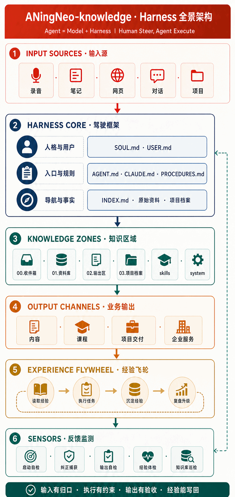
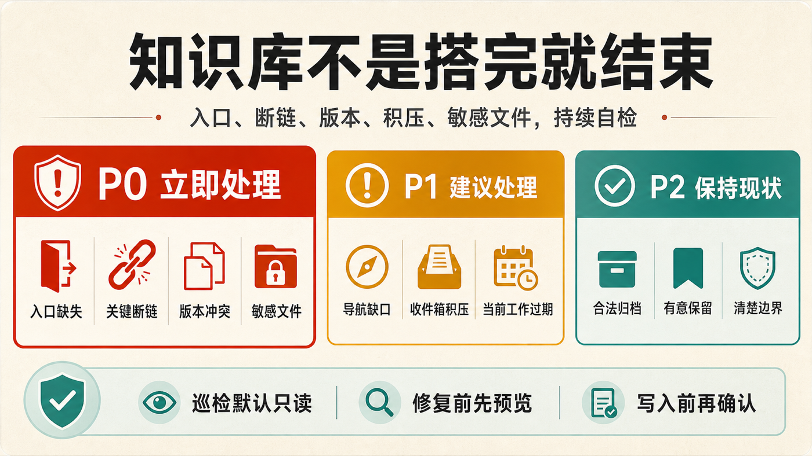

# aningneo-knowledge｜AI 知识库运行框架


> 让 AI 每次开工都知道你是谁、正在推进什么、哪些资料可信，以及出错后该怎样修正。

## 从“存了很多资料”到“AI 能持续工作”

文件数量并不等于知识可用。真正的问题通常是：新会话找不到入口、不同版本互相冲突、业务规则散落各处，用户纠正过的错误下一次还会重演。

一套能长期运转的 AI 知识库，需要同时完成六件事：

1. 给 Agent 一个固定、可靠的启动入口；
2. 让它理解服务对象和协作方式；
3. 把重复发生的任务沉淀为默认程序；
4. 持续标记当前优先事项；
5. 让结论能够回到原始资料和事实源；
6. 把检查结果与用户纠正写回系统，供下一次执行复用。

`aningneo-knowledge` 用 Harness 把这些环节串成闭环：

```text
输入 → 约束 → 执行 → 输出 → 反馈 → 进化
```

它不会要求所有人套用同一套目录。面对空目录时，从最小骨架开始；面对已有资料库时，尽量保留原结构，只补齐缺失的入口、导航、规则和检查机制。

## 一张图看全系统



图里的重点不是文件夹有多少，而是资料进入、规则约束、任务执行、结果交付、经验沉淀和健康检查已经形成连续路径。

## Harness Core 落到哪些文件

| 层 | 关键文件 / 机制 | 解决什么问题 |
| --- | --- | --- |
| 入口层 | `AGENT.md`、`AGENTS.md`、`CLAUDE.md` | 规定 Agent 启动时先读什么、什么时候查库 |
| 上下文层 | `USER.md`、`SOUL.md`、`PROCEDURES.md`、`_本周.md` | 让 AI 知道用户是谁、怎么协作、现在做什么、遇事怎么做 |
| 导航与事实层 | `INDEX.md`、原始资料、业务区、项目档案 | 让 AI 找得到依据，同时保持回答可追溯 |
| 反馈层 | `log.md`、`MEMORY_LOG.md`、`state/`、巡检脚本 | 让变化可解释、纠正能沉淀、系统能持续自检 |

在成熟知识库里，这四层还会连接输入源、业务输出和经验飞轮：

```text
录音 / 笔记 / 网页 / 对话 / 项目资料
  → 收件箱与业务区
  → Guides 约束 + Model 执行
  → 内容 / 课程 / 项目交付 / 企业服务
  → Sensors 检查
  → 经验写回规则与 Skill
```

`v0.4.0` 在最小 Harness、导航和巡检基础上，补齐了资料接入、自我纠错和自媒体工作台模式。Plaud、Flomo、飞书、Notion 等自动同步仍属于后续独立接入层，不在当前版本里冒充现成功能。

## 一个 Skill，六种模式

### 1. 搭建

适合空目录或资料很少的情况。

它会先预览，再建立最小可用结构：入口、用户画像、协作人格、程序规则、当前工作、资料区、输出区、日志与状态层。初始化脚本不会覆盖已有文件。

### 2. 自媒体工作台

适合做小红书、抖音、视频号、B站、公众号或个人 IP 内容。

使用 `creator` profile 后会生成一条完整内容链：账号定位、对标调研、用户洞察、素材库、选题池、草稿、审核、定稿、待发布、已发布与复盘。对标、评论和逐字稿保留平台、作者、链接、日期和原始路径；一条内容只保留一个当前版本。

### 3. 资料接入

适合手里已有 PDF、Word、Excel、录音、视频、网页、笔记或旧文件夹，但 AI 找不到入口的情况。

它不会为了套模板大搬家，而是：

1. 先只读扫描文件类型、大小和敏感文件风险；
2. 再调用 Agent 已有能力读取非敏感内容；
3. 区分原始事实、外部观点、用户判断和程序经验；
4. 给出接入预览，确认后写入资料区、输出区或项目档案；
5. 更新资料索引、局部导航和变更日志。

原件只保留一个事实源；其他区域放链接、接入卡、摘要或业务产物。

### 4. 健康检查

适合知识库已经在使用，但担心慢慢失效的情况。



默认只读检查：

- Agent 入口和核心文件是否存在；
- `AGENT.md / AGENTS.md` 是否一致；
- `INDEX.md` 和入口中的本地路径是否失效；
- 主要目录是否没有进入导航；
- 是否出现多个无规则的“最终版 / 最新版”；
- 收件箱和当前工作是否长期积压；
- 是否混入 `.env`、Cookie、凭证、私钥或密码文件；
- 是否存在重复、孤岛、根级散落和索引腐化。

结果按三个层级输出：

- **P0 立即处理**：可能让 AI 读错事实、无法启动或暴露敏感数据；
- **P1 建议处理**：导航缺口、积压、时效和维护风险；
- **P2 保持现状**：合法归档、有意保留、职责清楚，不要为了整齐乱动。

用户要求保存状态时，会生成：

- `system/state/YYYY-MM-DD-知识库健康检查.md`
- `system/state/latest-health.json`

每次会话可以读取最近状态；超过 7 天未检查时提醒一次。批量接入资料、修改入口或搬迁主要目录后立即复查。

### 5. 修复

修复不是“自动清理一切”。它会：

1. 把问题分成可确定修复和需要业务判断；
2. 给出精确到路径的修改预览；
3. 用户确认后才写入、移动或指定有效版本；
4. 修复后重新巡检，证明问题已经消失；
5. 把结构变化写入日志，把用户纠正写入记忆。

### 6. 自我纠错

用户纠正 AI 时立刻写入 `MEMORY_LOG.md` 并标注同类次数；同类纠正达到 3 次，主动提议升级为 `PROCEDURES.md` 固定规则。升级必须由用户确认，重要任务前先翻最近纠正。

## 最小知识库长什么样

```text
知识库根目录/
├── AGENT.md
├── AGENTS.md
├── CLAUDE.md
├── INDEX.md
├── _本周.md
├── 00.收件箱/
├── 01.资料库/
│   └── _资料索引.md
├── 02.输出区/
├── 03.项目档案/
├── skills/
└── system/
    ├── SOUL.md
    ├── USER.md
    ├── PROCEDURES.md
    ├── HEALTH.md
    ├── MEMORY_LOG.md
    ├── log.md
    └── state/
```

这是启动骨架，不是所有人都必须照抄的最终目录。真实业务变多后，再增加业务区、项目档案、区域入口和 Skill 注册表。

## 安装

```bash
npx -y skills@latest add 8533502-dev/ANingNeo-skills \
  --skill aningneo-knowledge \
  -y
```

也可以使用 GitHub CLI：

```bash
gh skill install 8533502-dev/ANingNeo-skills \
  aningneo-knowledge \
  --agent codex \
  --scope user
```

## 直接这样用

```text
调用 aningneo-knowledge，把这个文件夹搭成 AI 系统知识库，先审计和预览。
调用 aningneo-knowledge，按自媒体模式搭建知识库，管理对标、选题、文稿和发布数据，先预览。
调用 aningneo-knowledge，读取这批资料，区分外部观点和我的判断，先给接入方案。
调用 aningneo-knowledge，检查知识库健康状态并保存报告，不要自动修复。
调用 aningneo-knowledge，根据巡检报告给修复预览，我确认后再改。
```

## 脚本

预览最小知识库初始化：

```bash
python3 scripts/init_knowledge_base.py --root /path/to/knowledge-base --name "我的知识库"
```

确认后执行：

```bash
python3 scripts/init_knowledge_base.py --root /path/to/knowledge-base --name "我的知识库" --apply
```

预览自媒体工作台：

```bash
python3 scripts/init_knowledge_base.py \
  --root /path/to/knowledge-base \
  --name "我的自媒体知识库" \
  --profile creator
```

只读巡检：

```bash
python3 scripts/audit_knowledge_base.py --root /path/to/knowledge-base --format markdown
```

保存最新健康状态：

```bash
python3 scripts/audit_knowledge_base.py \
  --root /path/to/knowledge-base \
  --format markdown \
  --save-state
```

扫描一批待接入资料：

```bash
python3 scripts/scan_materials.py \
  --source /path/to/materials \
  --format markdown
```

## 安全边界

- 初始化脚本不覆盖已有文件；
- 巡检和资料扫描脚本默认只读，不读取密钥内容；
- 只有显式使用 `--save-state` 才会写入健康状态；
- 移动、覆盖、删除、归档和指定有效版本前必须确认；
- 不上传用户资料到第三方平台；
- 不把 `.env`、Cookie、浏览器数据或聊天数据库收进知识库；
- 不为了“看起来完整”预建一堆空目录；
- 脚本负责确定性检查，业务判断仍然回到原始文件。

## 它不是什么

- 不是 Obsidian 主题或笔记美化模板；
- 不是向量数据库、Embedding 服务或云端 RAG；
- 不是未经确认的自动搬家工具；
- 不是把索引摘要当成事实本身；
- 不是一次搭完、以后永远不用维护的静态文件夹。

## 验收标准

搭建完成后，Agent 应该能按顺序加载用户、人格、规则、导航、当前工作和最近健康状态；回答能回到原始资料；用户知道资料往哪里放、怎样找、怎样产出、怎样发起健康检查。

资料接入完成后，每批资料都有来源、所有权、日期、状态、原始路径和下一步用途，外部观点不会被写成用户判断。

健康检查完成后，每个问题都必须有真实路径、证据、可能影响和建议动作；未经确认不能移动、覆盖或删除任何资料。

## 参考与演进

`aningneo-knowledge` 的全景表达参考了小麦老师公开分享的 Harness 知识库实践：输入源、Harness Core、知识区域、输出渠道、经验飞轮和 Sensors 共同形成闭环。

在此基础上，`v0.1.0`（旧名 `ysj-knowledge`）先实现最小入口、既有目录接入和确定性巡检；`v0.2.0` 更名并补齐公开安装与资料接入；`v0.3.0` 加入自我纠错；`v0.4.0` 增加自媒体工作台模式。
